# MACHINE LEARNING ENGINEER WITH MICROSOFT AZURE NANODEGREE PROGRAM BY UDACITY - CAPSTONE PROJECT  

## TABLE OF CONTENTS
* [Project Overview](#project-overview)
  * [Projct Architecture](@project-architecture)
* [Project Set Up and Installation](#project-set-up-and-installation)
* [Dataset](#dataset)
  * [Overview](#overview)
  * [Task](#task)
  * [Access](#access)
* [Automated ML](#automated-ml)
  * [Results](#results)
* [Hyperparameter Tuning](#hyperparameter-tuning)
  * [Results](#results)
* [Model Deployment](#model-deployment)
* [Screen Recording](#screen-recording)
<hr/>

## Project Overview
> This project is part of the Udacity's Machine Learning Engineer with Microsoft Azure Nanodegree Project.

* In this project, two models were created:
  * Using Automated ML (AutoML)
  * Using customized model whose hyperparameters were tuned using ***HyperDrive***.
* The performance of both the models were compared and the best _performing model was deployed_.

### Project Architecture
* The image below shows the workflow and architecutre used in the project.
  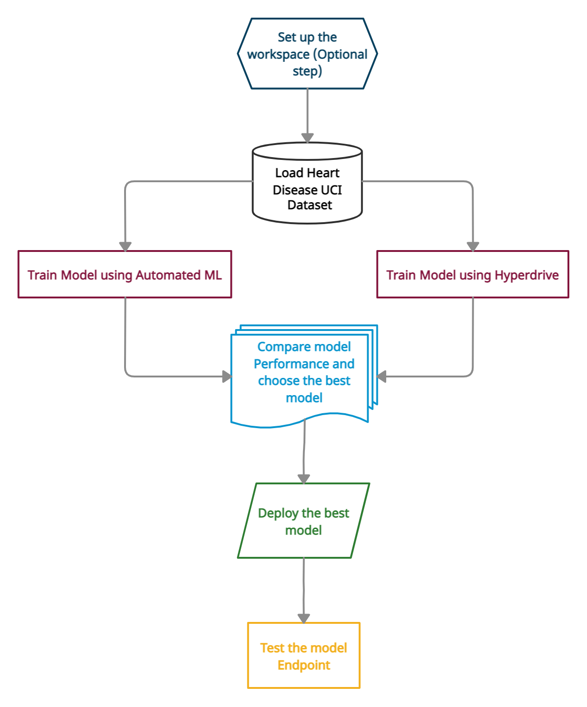
  
## Project Set Up and Installation
* In this project, the Azure ML lab offered by Udacity was used. Hence, the Workspace was already set up and ready.
* A compute instance `compute-project` was created with STANDARD_DS3_V2 VM size. 
* A remote ML compute cluster, `_cpu-cluster_`, was used to train the models on the dataset. The dedicated virtual machine size of the compute cluster was `STANDARD_DS12_V2`, with `1 minumum and 6 maximum number of nodes` and `CPU as the Processing unit`.


* The screenshot below shows the compute instance used in the project to run the experiments.
  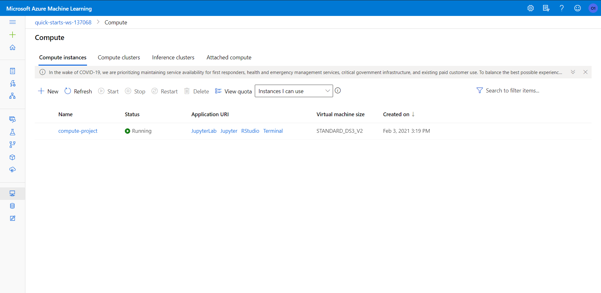
  
* The starter files from this [project repository](https://github.com/udacity/nd00333-capstone) were forked and cloned to the workspace.
<hr/>

## Dataset
* A dataset external to the Azure ML ecosystem was chosen to train the AutoML and HyperDrive runs.

### Overview
* To train the models, the [Heart Disease UCI](https://www.kaggle.com/ronitf/heart-disease-uci) dataset was used from [Kaggle](https://www.kaggle.com).
* This dataset originally contains 76 attributes and was taken from the [UCI Machine Learning Repository Archive](https://archive.ics.uci.edu/ml/datasets/Heart+Disease).
* But all published experiments refer to using a subset of 14 of them. The following features are part of the dataset:
  * `Age (age)`: The person’s age in years  
  * `Sex (sex)`: The person's sex 
    * 1: male
    * 0: female
  * `Chest pain type (cp)`: The type of chest pain the person experiences
    * 0: Typical Angina Chest Pain
    * 1: Atypical Angina Chest Pain
    * 2: Non-Anginal Chest Pain
    * 3: Asymptomatic Chest Pain
  * `Resting Blood Pressure (trestbps)`: Resting Blood Pressure (in mm Hg) of the person on admission to the hospital
  * `Cholesterol (chol)`: Serum cholestoral in mg/dl
  * `Fasting Blood Sugar (fbs)`: If the person's Fasting Blood sugar level is greater or less than 120 mg/dl
    * 0: False (less than 120 mg/dl)
    * 1: True (greater than 120 mg/dl)
  * `Resting Electrocardiographic (restecg)` : The person's ECG result when at rest to find whether T wave exists.
    * 0: Normal
    * 1: ST-T wave abnormality (T wave inversions and/or ST elevation or depression of > 0.05 mV)
    * 2: Probable or Definite Ventricular Hypertrophy
  * `Maximum Heart Rate Achieved (thalach)`: The maximum heart rate (heart beat per minute) of the person
  * `Exercise induced Angina (exang)`: If the person had an Anginal chest pain due to exercise. (Angina is caused when there is limited blood supply to the heart)
    * 0: No
    * 1: Yes
  * `ST depression induced by exercise (oldpeak)`: Pressure of the ST segment of the wave in person's ECG compared to rest ECG
  * `Slope (slope)`: Slope of the peak exercise ST segment of the wave in ECG of the person. 
    * 0: upsloping
    * 1: flat
    * 2: downslopin
  * `Number of major vessels (ca)`: Number of major vessels colored by flourosopy procedure of the person
    * 0, 1, 2 and 3
  * `Thalassemia (thal)`: Categories of complications of the thalassemia defect. 
    * 1: Normal
    * 2: Fixed Defect
    * 3: Reversable Defect
  * `Target (target)`: The presence of absence of heart disease in the patient.
    * 0: Absence
    * 1: Presence
    
### Task
* The goal of the project was to train the model to predict whether a patient has heart disease or not.
* All the features mentioned above were used to train the model and the the prediction column is `Target (target)` which was used by the model to predict whether a person has heart disease or not.
* Once the dataset was loaded for both the training experiments, it was cleaned using the _`clean_data()`_ method predefined in the [train.py](train.py) file that performed various preprocessing steps such removing duplicate rows, one hot encoding, removing unnecessary categorical values etc.
* The cleaned data was then split into train and test sets in 80-20 ratio using the _`train_test_split()`_ method of scikit-learn module.

### Access
* The dataset was uploaded and registered to the Azure default datastore as a Tabular Dataset using the [csv file](heart.csv).
  ```
  from azureml.data.dataset_factory import TabularDatasetFactory
  url_path = "https://raw.githubusercontent.com/bharati-21/AZMLND-Capstone-Project/master/files/heart.csv"
  ds = TabularDatasetFactory.from_delimited_files(path=url_path)
  ```
<hr/>

## Automated ML
* ***Automated Machine Learning (AutoML):***
  * AutoML is the process of automating the time consuming, iterative tasks of machine learning model development. 
  * It helps in developeing ML models with high scale, efficiency, and productivity all while sustaining model quality. 
  
* ***Steps involved in developing the model:***
  * Training a model with the given dataset was identified to be a `_classification_` task since the goal was to predict whether a person has heart disease or not.
  * In this project `_Python SDK_` was used to complete the task. But the Azure ML studio designer can also be used to train the model.
  
  * __`AutoMLConfig`__ Class was used to create the configurations for submitting the AutoML run experiment.   
    1. **The settings created for the AutoML run was**:
       * `Experiment Timeout (experiment_timeout_minutes)`: Maximum amount of time (in minutes) that all iterations combined can take before the experiment terminates.
       * `Primary Metric (primary_metric)`: The primary metric which is used to evaluate every run. In this case, accuracy is the primary metric to be evaluated.
       * `Cross Validations (n_cross_validations)`: Specifies the number of cross validations that needs to be performed on each model by splitting the dataset into n subsets.
       ``` 
       automl_settings = {
        "experiment_timeout_minutes": 30,
        "primary_metric": 'accuracy',
        n_cross_validations = 5,
       }
       ```
      
    1. **The AutoMLConfg object was defined as follows**:
       * Task to be performed (task): The tpye of task that needs to be run such as classification, regression, forecasting etc. In this project classification is the task to be performed.
       * Training Data (training_data) = The TabularDataset that contains the training data.
       * Label Column (label_column_name): Name of the column that needs to be predicted. In this case the column that contains "yes" or "no" to perform classification.
       * Compute Target (compute_target): The cluster used to run the experiment on.
       ```
       automl_config = AutoMLConfig (
         task = 'classification',
         training_data = train_data,
         label_column_name = "target",
         enable_onnx_compatible_models = True,
         compute_target = cpu_cluster,
         **automl_settings
       )
       ```
    1. **Submit the training run**:
       * The run was submitted to the experiment and AutoMLConfig object was passed as a parameter to the run:
       ```
       remote_run = experiment.submit(automl_config, show_output = True)
       ```
    
  * The screenshot below shows the run progress of submitted AutoML experiment
    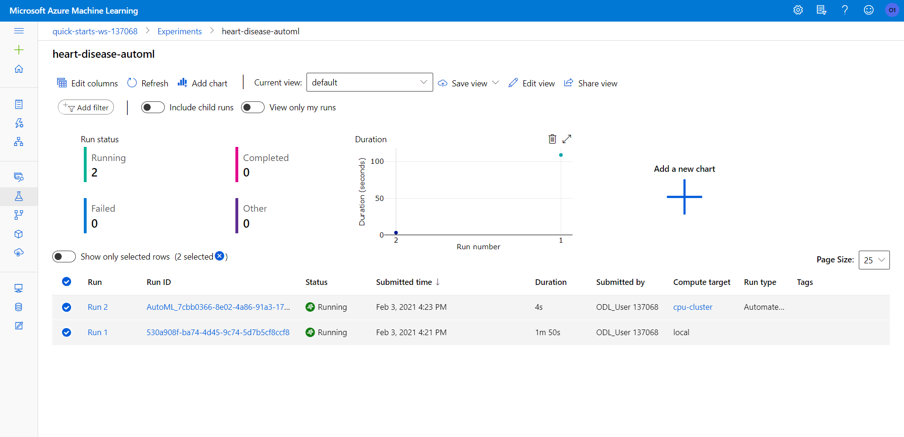
  
  * Once submitted the progress of the run was observed via the run widget of the _`RunDetails`_ class in the Jupyter notebook. 
    ```
    from azureml.widgets import RunDetails
    RunDetails(remote_run).show()
    ```
    
  * The screenshot below shows the widget that tracks and displays the AutoML run progress
  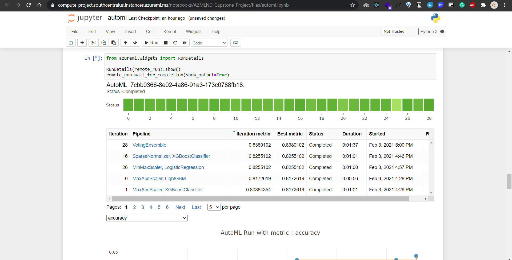
   
### Results
* The screenshot below shows the run progress as ***completed*** for the submitted AutoML experiment   
    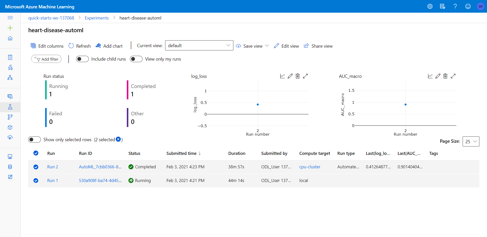

* The screenshot below shows the completed AutoML experiment run details
  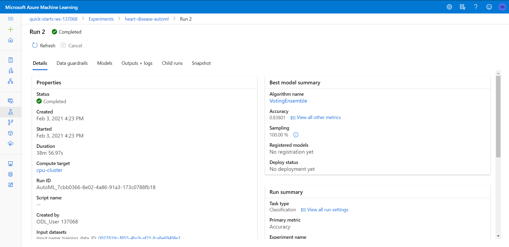
    
* The best model obtained post training with the highest accuracy was a `VotingEnsemble` algorithm with an accuracy of _`0.8380`_. 
* `ensembled_iterations`: [26, 16, 0, 1, 4]
* `ensemble_weights`: [0.3333333333333333, 0.16666666666666666, 0.16666666666666666, 0.16666666666666666, 0.16666666666666666]

***Voting Ensemble Algorithm***
  * A Voting Classifier is a machine learning model that trains on an ensemble of numerous models and predicts an output (class) based on their highest probability of chosen class as the output.
  * It aggregates the findings of each classifier passed into Voting Classifier and predicts the output class based on the highest majority of voting. 
  * Instead of creating separate dedicated models and finding the accuracy for each them, we create a single model which trains by these models and predicts output based on their combined majority of voting for each output class.

* The run was registered with the provided workspace using the _`register_model()`_ method of _`Model`_ class.
  ```
  description = "AutoML model trained on the Kaggle Heart Disease UCI Dataset"
  joblib.dump(fitted_model, filename="outputs/automl-heart-disease.pkl") # saving the model locally
  automl_model = remote_run.register_model(model_name='automl-heart-disease', description=description)
  ```
  * `workspace`: Workspace name to register the model with.
  * `model_name`: The name to register the model with.
  * `description`: A text description of the model.

* The best run of the AutoML experiment was then obtained using _`get_outpu()`_.
  ```
  best_run, fitted_model = remote_run.get_output()
  ```

* The following Algorithms were used on the dataset to retrieve the trained model:
  1. `LogisticRegression`
  1. `XGBoostClassifier`
  1. `LightGBM`
  1. `RandomForest`
  1. `SVM`
  1. `GradientBoosting`
  1. `ExtremeRandomTree`
  1. `KNN`
  1. `VotingEnsemble`
  
* The screenshot below shows the best run details and metrics of the completed AutoML experiment

  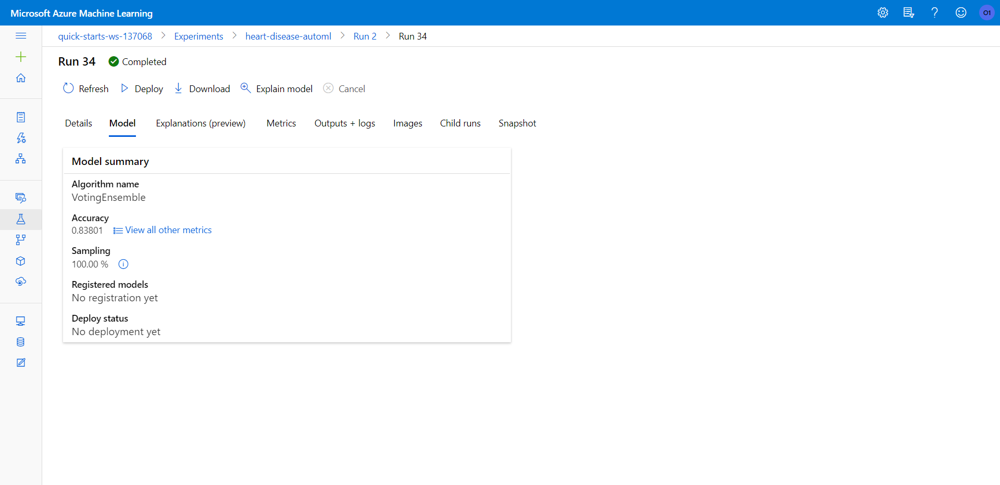
  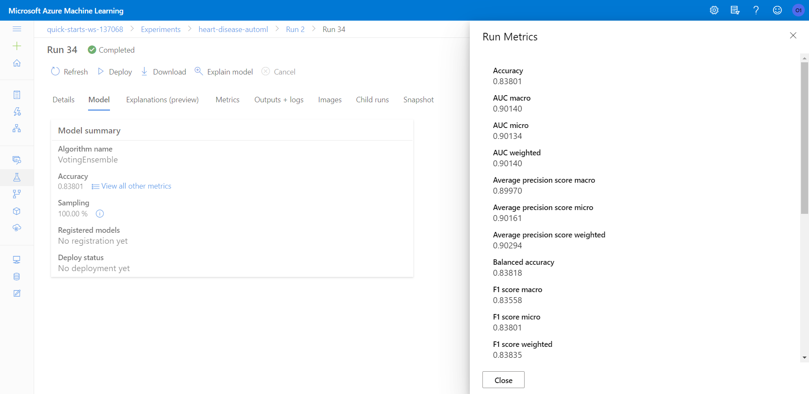

<hr/>

## Hyperparameter Tuning
* ***Hyperparameter Tuning:***
  * _Hyperparameters_ are adjustable parameters that controls the model training process and the model performance depends heavily on hyperparameters.
  * *Hyperparameter tuning* (hyperparameter optimization), is the process of finding the configuration of hyperparameters that results in the best performance. The process is computationally expensive and manual. 
  * The _`HyperDrive`_ package in Azure ML automates and optimizes tuning of hyperparameters by using the _`HyperDriveConfig()`_.

* ***Steps involved in training the model:***
  * This training approach used a _`Scikit-learn Logistic Regression`_ algorithm to simplify the training process of the model on the dataset which took in 2 hyperparameters: 
    * `--C`: Inverse of regularization strength
    * `--max-iter`: Maximum number of iterations that should be taken to converge.. 
  * The hyperparameters for Logistic Regression were chosen and optimized using the HyperDrve to obtain the best model with the highest accuracy.
  
  1. Specify an estimator:
     * An SKLearn Estimator SKLearn estimator was used to begin the training and invoke the training script file.
     ```
     estimator = SKLearn (
       compute_target= cpu_cluster,
       entry_script= "train.py"
     )
     ```
     
  1. Define the parameter search space:
     * The search space for randomly choosing hyperparameters was selected. The search space in this project were specified as `choice` for `--max_iter``, and `uniform` for `--C`.
     * This search space was then fed to a parameter sampler which specified the method to select hyperparameters from the search space. This experiment used a RandomParameterSampling sampler to randomly select values specified in the search space for --C and --max_iter.
     ```
      param_sampling = RandomParameterSampling({ 
       "--C" : uniform(0.01, 1),
       "--max_iter" : choice(10, 50, 100, 150, 200)
     })
     ```
     
  1. Specify a primary metric: 
     * Primary Metric (primary_metric_name) is used for evaluating and comparing run results. The project used _`accuracy`_ as the primary metric with the goal (primary_metric_goal) value _`primary_metric_goal.MAXIMIZE`_ to maximize the primary metric in every run.
     
  1. Specify early termination policy:
     * An early termination policy was passed to ensure low performing runs were terminated and resources not wasted. In this experiment the _`BanditPolicy`_ was used.
     
  1. Allocate resources:
     * Resources for controlling and running the experiment were specified using _`max_concurrent_runs`_ (Maximum number of runs that can run concurrently in the experiment) and _`max_total_runs`_ (Maximum number of training runs).
     
  1. Define HyperDriveConfig:
     * The best configuration for the run was defined using a HyperDriveConfig object.
     ```
     hyperdrive_run_config = HyperDriveConfig (
         estimator = estimator, 
         hyperparameter_sampling = param_sampling, 
         policy = early_termination_policy,
         primary_metric_name = 'accuracy', 
         primary_metric_goal = PrimaryMetricGoal.MAXIMIZE, 
         max_total_runs = 20,
         max_concurrent_runs = 4
     )
     ```
    
  1. Submit Run and Save the best model
     * The run was submitted to the experiment and HyperDriveConfig object was passed as a parameter to the run"
     ```
     run = experiment.submit(hyperdrive_run_config)
     ```
    
  * The screenshot below shows the run progress of submitted HyperDrive periment
    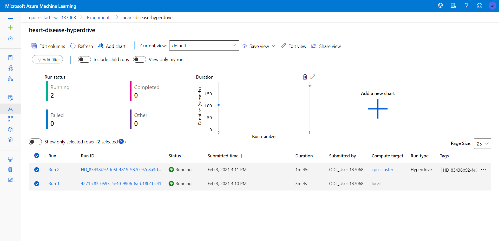
  
  * Once submitted the progress of the run was observed via the run widget of the _`RunDetails`_ class in the Jupyter notebook. 
    ```
    from azureml.widgets import RunDetails
    RunDetails(run).show()
    ```
  
  * The screenshot below shows the widget that tracks and displays the AutoML run progress
  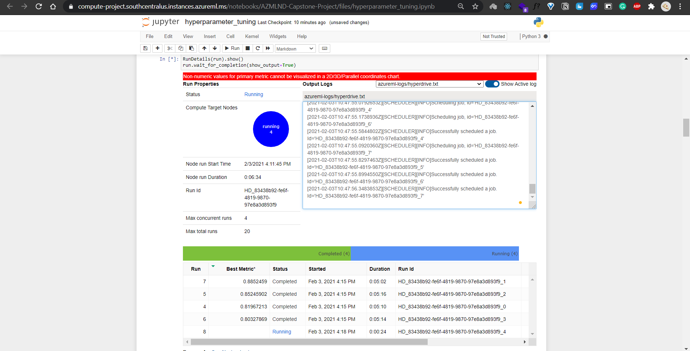

### Results
* The screenshot below shows the run progress as ***completed*** for the submitted Hyperdrive experiment   
    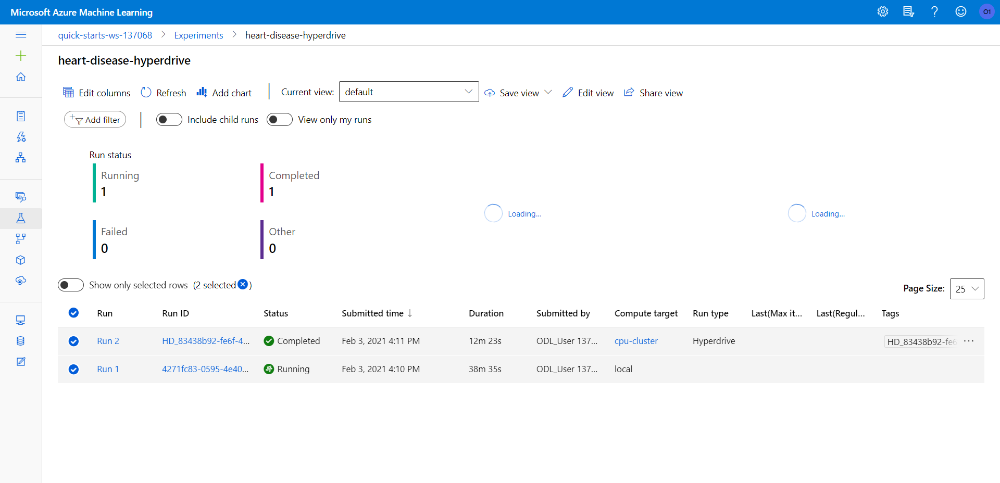

* The screenshot below shows the completed Hyperdrive experiment run details
  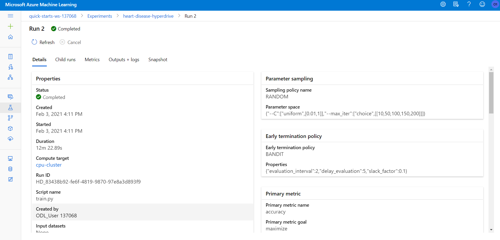
      
* The best model obtained post training had an highest accuracy of _`0.8852`_. 
* `Parameter Values`:  ['--C', '0.8750515086805049', '--max_iter', '200']

* The best run of the experiment was retrieved using the _`get_best_run_by_primary_metric()`_ method of _`HyperDriveRun`_ class.
  ```
  best_run = run.get_best_run_by_primary_metric()
  ```
  
* The best run is then registered using the _`register_model()`_ method of _`Model`_ class.
  ```
  description = 'Model trained on the Heart Disease UCI Machine Learning Dataset from Kaggle' 
  registered_model = best_run.register_model(model_name = 'hyperdrive-heart-disease',
                                             model_path = './outputs/hyperdrive-heart-disease.pkl',
                                             model_framework = Model.Framework.SCIKITLEARN,
                                             model_framework_version = '0.22.2',
                                             description = description)
  ```
  * `model_name`: The name to register the model with.
  * `model_path`: This parameter refers to the cloud location of the model.
  * `model_framework`: The framework of the model to register. 
  * `model_framework_version`: The framework version of the registered model.
  * `description`: A text description of the model.

* The screenshot below shows the best run details of the completed hyperdrive experiment
  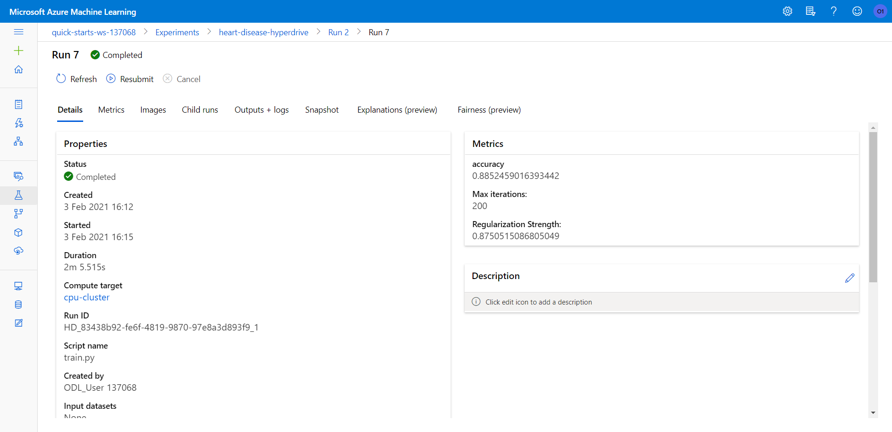


## Model Deployment
* The best model was obtained after completing both the training experiments and was found to be the model trained using the Scikit-Learn Logistic Regression whose hyperparameters were tuned using HyperDrive.

***Steps Followed to Deploy the Model:***
1. **Define an entry script**
   * An entry script was written which receives data submitted to the deployed web service and passes it to the model. 
   * It then takes the response returned by the model and returns that to the client. 
   * The entry script[ _`score.py`_](score.py) conatined:
     * `init()`: to loading the model 
     * `run()`: to run the model on input data
     
1. **Define an inference configuration**:
   * An inference configuration describes how to set up the web-service containing your model, which is used later while deploying the model.
   * An environment wass loaded from the workspace and then cloned.
   * Several dependenices were specified such as _`scikit-learn`_ using _`CondaDependencies`_.
   * The environment was then used to create an _`InferenceConfig`_.
     ```
     env = Environment.get(ws, "myenv").clone('new_myenv')
     myenv = Environment.from_conda_specification(name="myenv", file_path="myenv.yml")
     inference_config = InferenceConfig(entry_script="score.py", environment=myenv)
     ```

1. **Choose compute target and deployment configuration**
   * The compute target is used to host the model, and it will affect the cost and availability of the deployed endpoint.
   * Deployment configuration defined is specific to the compute target that will host the web service and is used to define the characteristics of the compute target that will host the model and entry script.
   * This project used the `Azure Container Instances (ACI)` and the configuration was defined as follows:
     ```
     from azureml.core.webservice import AciWebservice
     aci_config = AciWebservice.deploy_configuration(cpu_cores=1, 
                  memory_gb=1, 
                  description='Predict if a person has Heart disease or not',
                  auth_enabled = True
     )
     ```
   * Authentication was also enabled for the deployed model.

1. **Deploy the machine learning model**
   * To deploy the model, _`deploy_configuration()`_ method of the _`AciWebservice`_ class was used.
   * The following parameters were passed to the method:
     * `workspace`: The workspace object containing the model to retrieve.
     * `name`: The name of the model to retrieve.
     * `inference_config`: The inference config that defines how to set up the webservice of the deployed model.
     * `deployment_config`: The deployment configuration specifying the compute target and it's characteristics to host the service.
     ```
     service = Model.deploy(workspace=ws, 
                       name='heart-disease-hyperdrive', 
                       models=[model], 
                       inference_config=inference_config, 
                       deployment_config=aci_config
     )
     ```

* The screenshot below shows the deployed model endpoint.

  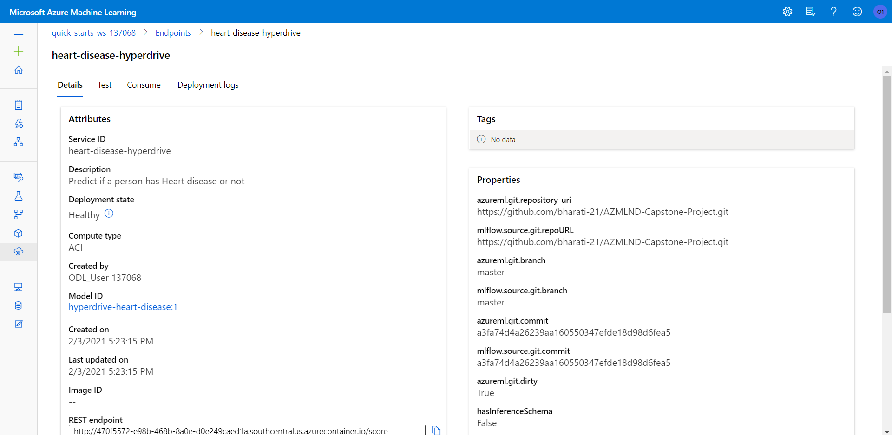
  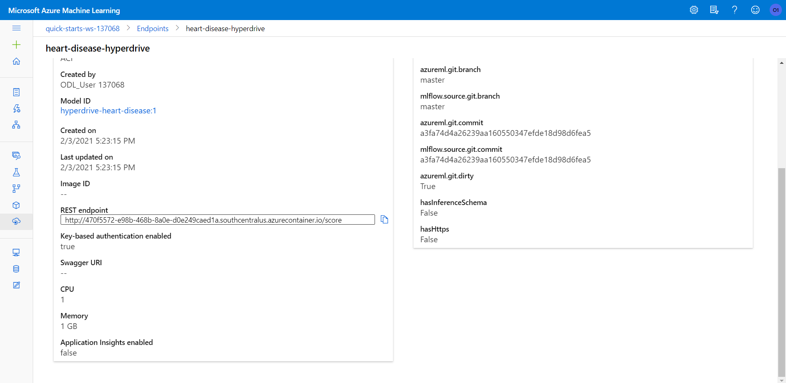

***Steps Followed to Query the Model Endpoint:***
* Firstly, the application insights for displaying logs was enabled for the deployed model endpoint by:
  ```
  service.update(enable_app_insights=True)
  ```
* The screenshot below shows the application insights enabled for the deployed model endpoint.
  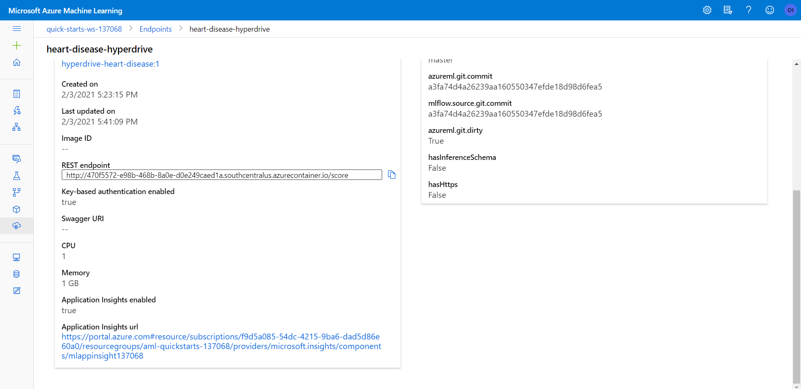
  
* The screenshot below shows site accessed using the Application insights URL
  
  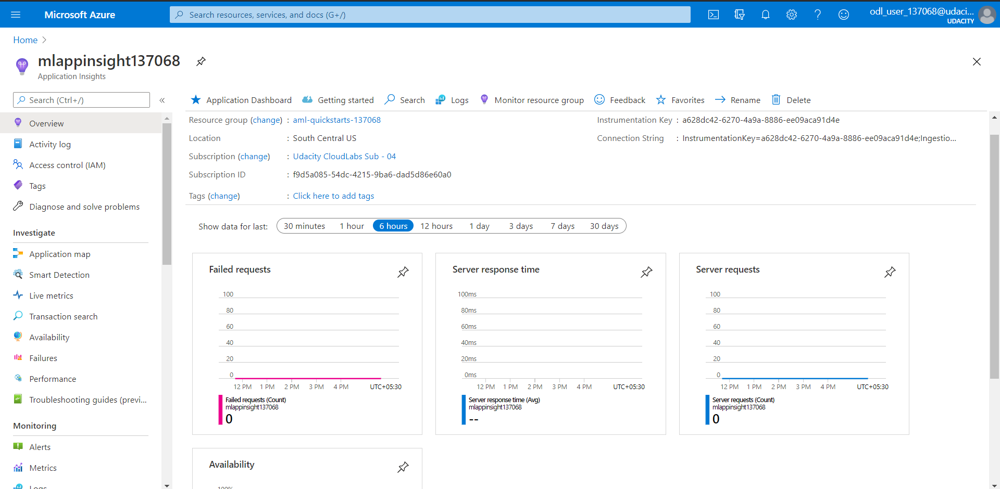
  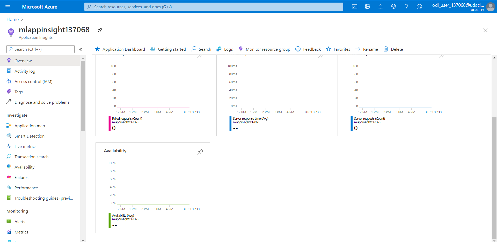
  
* Using the scoring URI and key, the web service endpoint was queried to obtain the classification result for a randomly selected sample data from test data.
* Raw HTTP request was sent to the deployed endpoint using _`requests.post()`_ method.
* The scoring URI, sample JSON input data, and the content type was passed to the post() as parameters.
* The prediction was obatained using the _`text`_ attribute of the response that was received from the request. 
  ```
  random_index = np.random.randint(0, len(test_x)-1)
  input_data =  [list(test_x.iloc[random_index])] 
  input_data = json.dumps(input_data)

  response = requests.post(scoring_uri, input_data, headers=headers)
  print(response.text)
  ```

## Screen Recording
*TODO* Provide a link to a screen recording of the project in action. Remember that the screencast should demonstrate:
- A working model
- Demo of the deployed  model
- Demo of a sample request sent to the endpoint and its response

## Standout Suggestions
*TODO (Optional):* This is where you can provide information about any standout suggestions that you have attempted.
